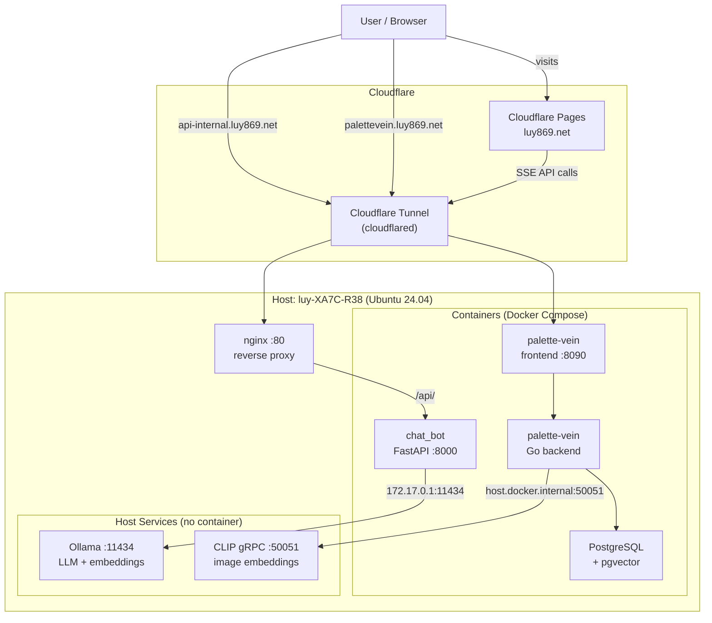

# homelab

Self-hosted home-server monorepo — two production apps, local LLM inference, and zero exposed ports.

## What is this?

A dual-GPU Ubuntu server running portfolio-grade projects behind Cloudflare Tunnel — local LLM inference, semantic image search, and zero exposed ports.

- **RAG Chatbot** — answers questions about the owner using a local LLM and embeddings ([chat_bot](https://github.com/luy869/chat_bot))
- **CLIP-based Image Recommendation** — semantic image search via CLIP embeddings and pgvector ([palette-vein](https://github.com/luy869/palette-vein))
- **Ollama LLM Inference** — local inference and embeddings (qwen3.6, gemma4, bge-m3)
- **Cloudflare Tunnel** — public HTTPS access with no port-forwarding and no exposed home IP
- **Docker Compose** — single `compose.yaml` at the repo root orchestrates both apps

## Architecture



## Public endpoints

| Subdomain | Purpose |
|---|---|
| `luy869.net` | Portfolio site (Cloudflare Pages) — hosts the chat widget |
| `api-internal.luy869.net` | Chat bot API (SSE streaming) |
| `palettevein.luy869.net` | Palette Vein image recommendation frontend |

Admin access is over **Tailscale + SSH** only (not public).

## Hardware

| | |
|---|---|
| Host | `luy-XA7C-R38` |
| OS | Ubuntu 24.04 LTS |
| CPU | 16-core |
| RAM | 31 GB |
| GPU 0 | NVIDIA GTX 1660 Ti (6 GB VRAM) |
| GPU 1 | NVIDIA GTX 1070 (8 GB VRAM) |
| Role | Dedicated, headless services box (24/7) — not a desktop or gaming machine |

## Tech stack

| Area | Technologies |
|---|---|
| LLM / Embeddings | Ollama, qwen3.6, gemma4, bge-m3 |
| RAG backend | FastAPI, Python |
| Image recommendation | Go (backend), Python CLIP (gRPC service), PostgreSQL + pgvector |
| Containerisation | Docker, Docker Compose (`include`) |
| Reverse proxy | nginx |
| Tunneling / TLS | Cloudflare Tunnel (cloudflared) |
| CDN / Hosting | Cloudflare Pages |
| Networking (admin) | Tailscale + SSH |

## Getting started

```bash
# 1. Clone with submodules
git clone --recurse-submodules https://github.com/luy869/homelab.git
cd homelab

# 2. Create each app's .env (secrets — gitignored). See ./.env.example for the variables.
cp apps/palette-vein/.env.example apps/palette-vein/.env   # palette-vein ships a template
# chat_bot has no template — create apps/chat_bot/.env from the block in ./.env.example
# Then edit both files with your real values.

# 3. Ensure host services are running
#    - Ollama:     ollama serve
#    - CLIP gRPC:  (see services/clip.md)
#    - nginx:      sudo systemctl start nginx
#    - cloudflared: (see proxy/cloudflared/config.yml)

# 4. Start all containers
./scripts/up.sh

# 5. Verify everything is healthy
./scripts/status.sh
# Prints ✓/✗ for GPUs, containers, tunnel, Ollama, and public endpoints
```

## Repository layout

```
homelab/
├── README.md
├── docs/architecture.md
├── compose.yaml            # root orchestration (include of both apps)
├── .env.example
├── proxy/
│   ├── cloudflared/config.yml
│   └── nginx/{nginx.conf, sites-available/, sites-enabled/}
├── apps/
│   ├── chat_bot/           # submodule → github.com/luy869/chat_bot
│   └── palette-vein/       # submodule → github.com/luy869/palette-vein
├── services/{ollama.md, clip.md}
└── scripts/{up.sh, down.sh, status.sh}
```

## Notes

- **Secrets are gitignored.** All `.env` files and the cloudflared credentials JSON are excluded from version control. See `.env.example` for required variables.
- **Host services are intentionally not containerised.** Ollama and the CLIP gRPC service run directly on the host to keep GPU access simple — no container passthrough layer — and to make model and GPU-assignment management straightforward. See [docs/architecture.md](docs/architecture.md) for the full rationale.

## Roadmap

| Version | Status | Description |
|---|---|---|
| v1 | **In progress** | Monorepo integration — root compose, README + architecture diagram, `status.sh` |
| v2 | Planned | Monitoring dashboard (GPU / containers / health) at `dash.luy869.net` — FastAPI + React, JWT auth |
| v3 | Optional | Open WebUI for the local LLM at `chat.luy869.net` |
