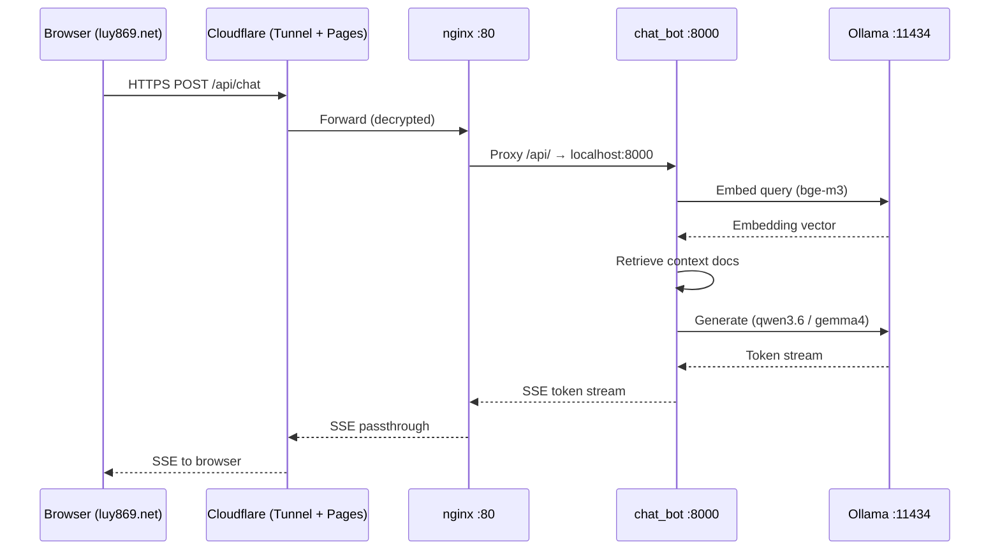

# Architecture

A detailed breakdown of how the homelab is structured, why each component lives where it does, and how data flows through the system.

---

## Component responsibilities

### Applications (git submodules)

| Component | Responsibility |
|---|---|
| **chat_bot** (`apps/chat_bot`) | FastAPI backend (port 8000). Accepts chat requests, retrieves relevant context via embeddings, calls Ollama for LLM inference, and streams answers back via SSE. |
| **palette-vein frontend** (`apps/palette-vein`, port 8090) | Static/SSR frontend served by a Docker container. Accepts image queries from the user and communicates with the Go backend. |
| **palette-vein Go backend** | Handles image recommendation logic: calls the CLIP gRPC service to embed query images, then queries PostgreSQL/pgvector for nearest-neighbour results. |
| **PostgreSQL + pgvector** | Stores image embeddings as vectors; serves ANN (approximate nearest-neighbour) queries for the recommendation engine. |

### Host services (not containerised)

| Service | Responsibility |
|---|---|
| **Ollama** (port 11434) | Runs local LLM inference (qwen3.6, gemma4) and embedding generation (bge-m3). Reachable from Docker containers at `http://172.17.0.1:11434`. |
| **CLIP gRPC service** (port 50051) | Python service that generates CLIP image embeddings on request. Reachable from containers at `host.docker.internal:50051`. |
| **nginx** (port 80) | Reverse proxy on the host. Serves the chat widget static frontend and routes `/api/` requests to the chat_bot container on `localhost:8000`. |
| **cloudflared** | Cloudflare Tunnel daemon. Maintains an outbound-only tunnel to Cloudflare's edge, making the server publicly reachable without any inbound firewall rules or port-forwarding. |

---

## Data flows

### 1. RAG Chat flow

```
User browser (luy869.net)
  → Cloudflare Pages (hosts the chat widget)
  → api-internal.luy869.net (Cloudflare DNS)
  → Cloudflare Tunnel (cloudflared on host)
  → nginx :80 on host
  → /api/ proxy rule → chat_bot FastAPI :8000
  → Ollama :11434 (bge-m3 for embedding the query)
  → vector store lookup (in-process or external)
  → Ollama :11434 (qwen3.6 / gemma4 for LLM generation)
  → SSE stream back through the same path to the browser
```

Step-by-step:

1. User opens `luy869.net` (Cloudflare Pages). The chat widget loads in the browser.
2. The widget sends a POST/GET to `api-internal.luy869.net` (HTTPS, handled by Cloudflare TLS termination).
3. Cloudflare Tunnel forwards the decrypted request to `nginx` on the host (port 80).
4. nginx matches the `/api/` prefix and proxies to `localhost:8000` (chat_bot container).
5. chat_bot embeds the user query via Ollama (`bge-m3` model, `172.17.0.1:11434`).
6. chat_bot retrieves relevant context documents using the embedding.
7. chat_bot sends a generation prompt to Ollama (`qwen3.6` or `gemma4`).
8. Ollama streams tokens back; chat_bot re-streams them as SSE to the client.

### 2. Image recommendation flow

```
User browser
  → palettevein.luy869.net (Cloudflare DNS)
  → Cloudflare Tunnel
  → palette-vein frontend :8090
  → palette-vein Go backend
  → CLIP gRPC service :50051 (host, via host.docker.internal)
  → PostgreSQL/pgvector (container, ANN query)
  → ranked results back to frontend → browser
```

Step-by-step:

1. User visits `palettevein.luy869.net` and submits an image query.
2. Cloudflare Tunnel forwards the request to the frontend container (port 8090).
3. The frontend passes the query to the Go backend (internal Docker network).
4. The Go backend calls the CLIP gRPC service (`host.docker.internal:50051`) to embed the query image.
5. With the embedding vector in hand, the backend queries PostgreSQL/pgvector for the nearest neighbours.
6. Results are ranked and returned to the frontend, then rendered for the user.

### Sequence diagram — Chat flow



---

## Design decisions

### Why are host services not containerised?

Ollama and the CLIP gRPC service run directly on the host for three related reasons:

1. **GPU access.** Docker's GPU passthrough (`--gpus`) works but adds an extra configuration layer. On a machine that also runs games and other GPU workloads, it is simpler and more reliable to let host services own the GPU directly.

2. **Dual-use machine.** `luy-XA7C-R38` is a daily-use desktop and gaming PC. Heavy inference services are started manually when needed, not auto-started on boot. Keeping them on the host makes it easy to `systemctl start ollama` or kill them without touching Docker.

3. **VRAM constraints.** With one 6 GB and one 8 GB GPU, VRAM is finite. Running Ollama inside a container can complicate VRAM allocation and makes it harder to quickly swap models or change GPU assignments.

Containers reach the host services via Docker's bridge gateway (`172.17.0.1`) or `host.docker.internal`.

### Why Cloudflare Tunnel instead of port-forwarding?

- **No inbound firewall rules.** cloudflared opens an outbound-only TLS tunnel to Cloudflare's edge. The router firewall needs no changes; no ports are opened to the internet.
- **Home IP is never exposed.** All traffic enters via Cloudflare's IP range, so the server's residential IP address stays private.
- **Free TLS.** Cloudflare handles certificate provisioning and renewal automatically.
- **DDoS / rate-limiting.** Cloudflare's edge absorbs volumetric attacks before they reach the home connection.

The alternative — forwarding ports 80/443 on the home router — would expose the home IP, require managing TLS certificates manually, and risk the ISP blocking inbound traffic.

### Why git submodules?

`apps/chat_bot` and `apps/palette-vein` are independently developed, each with its own GitHub repository, CI pipeline, and release cycle. Using git submodules means:

- Each app remains a standalone public repo (visible to recruiters as an independent project).
- The homelab repo pins a specific commit of each app, giving reproducible deployments.
- Developers can iterate on an app repo without touching the homelab orchestration layer.

The trade-off is the usual submodule friction (`--recurse-submodules`, explicit `git submodule update`), which is acceptable given the small team size (one person).

### Wrap-and-tidy approach

The homelab repo does not try to manage or restart host services (Ollama, CLIP, nginx, cloudflared). Those are treated as pre-conditions. The root `compose.yaml` only orchestrates the Docker containers, keeping its scope narrow and avoiding interference with the running system. `scripts/status.sh` observes everything (GPUs, host services, containers, public endpoints) without mutating state.
